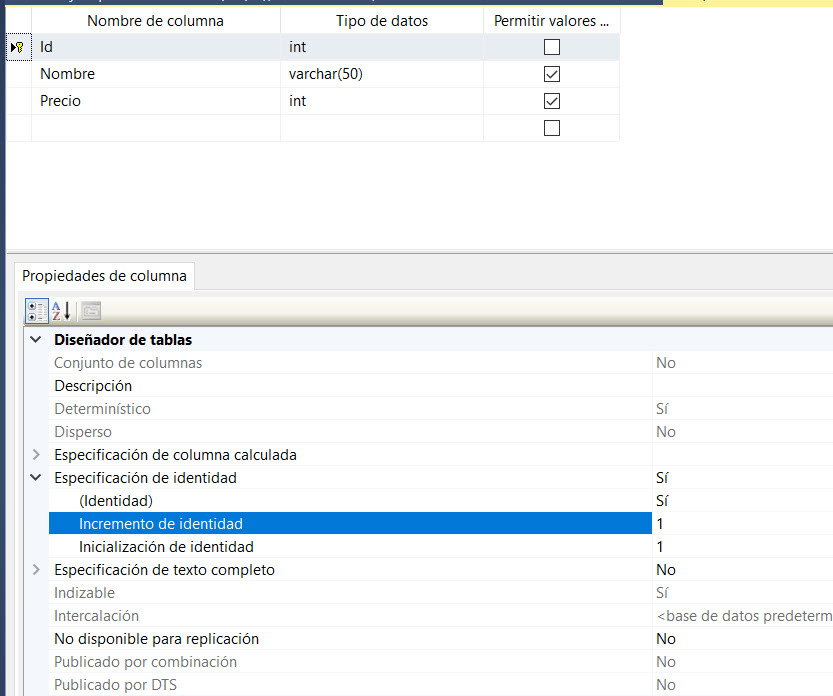

# vb2023_1

Como ejecutar este proyecto?
En App.config, cambiar la conexion de la base de datos por la que se va usar.

```xml
<add name="basevb" connectionString="data source=PCJC\SQLEXPRESS;initial catalog=cursovb;integrated security=True;MultipleActiveResultSets=True;App=EntityFramework" providerName="System.Data.SqlClient" />
```

Y en la base de datos, crear una tabla llamada Productos como sigue:


